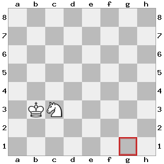

# Chess Puzzle in JavaFX

A king and a knight piece is placed as shown in the image.

The goal is to move the king or the knight to the square marked red (g1).

The pieces move according to the rules of the chess, with the following extra constraint: a piece can be moved if and only if it is on a square that is under attack by the other piece.

When a new game is started the program must ask for the name of the player.
The program must maintain a high score table in which the top 10 results are displayed.
You can score the players based on the steps/time required to solve the puzzle.

You can store the high score table in a database, in a JSON file, or in an XML document.
Optionally, you can implement load/save game functionality.

