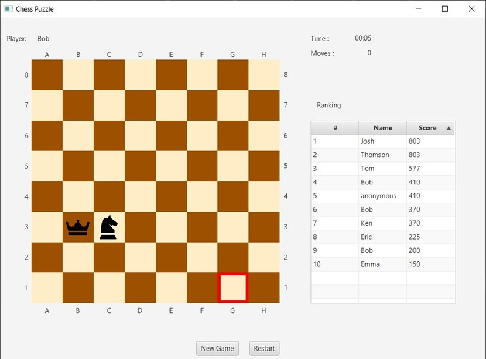

# Chess Puzzle in JavaFX

A king and a knight piece is placed as shown in the image.

The goal is to move the king or the knight to the square marked red (g1).

The pieces move according to the rules of the chess, with the following extra constraint: a piece can be moved if and only if it is on a square that is under attack by the other piece.

Score is based on the number of moves and time required to solve the puzzle.

Top 10 scores with player names are stored in a JSON file.

---
Copyrights of resources:

knight Icon made by <a href="https://www.flaticon.com/authors/pixel-perfect" title="Pixel perfect">Pixel perfect</a> from <a href="https://www.flaticon.com/" title="Flaticon"> www.flaticon.com </a>

king icons made by <a href="https://www.flaticon.com/authors/freepik" title="Freepik">Freepik</a> from <a href="https://www.flaticon.com/" title="Flaticon"> www.flaticon.com </a>

